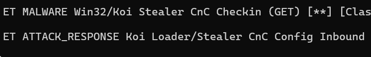
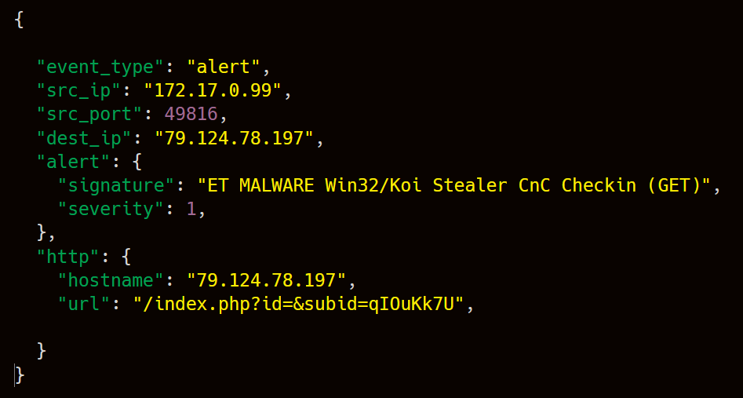
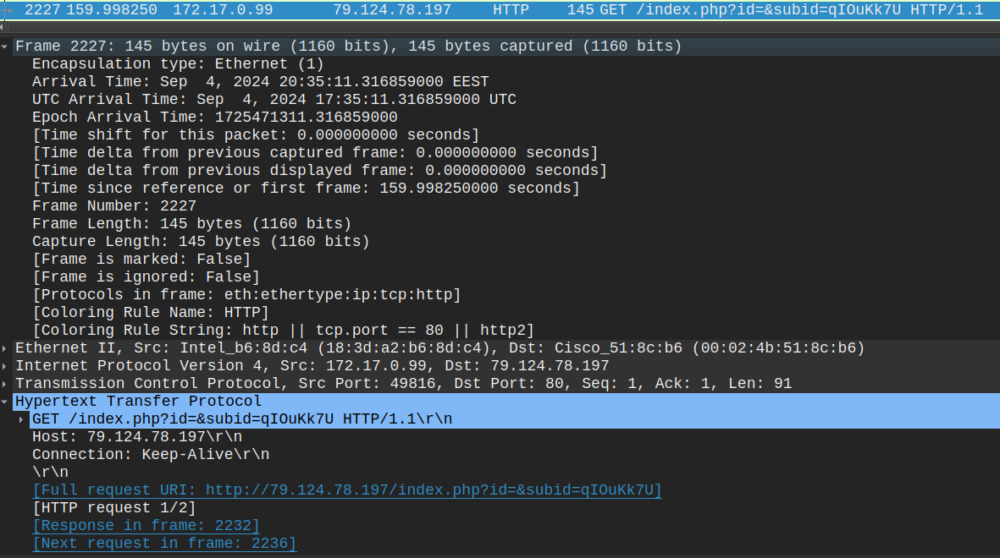

# Suricata IDS + PCAP Malware Investigation

## 1. Incident Summary

During analysis of a network traffic capture using Suricata IDS, a high-priority alert was triggered indicating possible malware command-and-control communication.

The alert identified activity associated with the **Koi Stealer** malware family.

Further investigation of the PCAP file in Wireshark confirmed outbound HTTP communication from the internal host **172.17.0.99** to the external IP address **79.124.78.197**.

The traffic included an HTTP GET request to the endpoint:

/index.php?id=&subid=qI0uKk7U

This behavior is consistent with malware beaconing to a command-and-control server.

## 2. Environment

The investigation was performed using the following tools:

- **Suricata IDS** for network threat detection
- **Wireshark** for packet-level traffic analysis
- **PCAP traffic sample** from malware-traffic-analysis.net

The analysis environment included:

- Ubuntu Server (Suricata IDS)
- Ubuntu Desktop (Wireshark analysis)

## 3. Detection (Suricata)



*Suricata alert identifying suspected Koi Stealer command-and-control communication.*

Suricata detected malware command-and-control activity associated with the **Koi Stealer** malware family.

**Triggered rule:**

ET MALWARE Win32/Koi Stealer CnC Checkin (GET)

Additional related alert:

ET ATTACK_RESPONSE Koi Loader/Stealer CnC Config Inbound



*Example of Suricata EVE JSON alert event showing telemetry generated during analysis.*

## 4. Network Traffic Analysis (Wireshark)



*Wireshark inspection showing HTTP GET request from the infected host to the suspected C2 server.*

Further inspection of the PCAP file in Wireshark confirmed outbound HTTP communication between the internal host and the suspected command-and-control server.

The infected host **172.17.0.99** initiated an HTTP GET request to the external server **79.124.78.197**.

Request observed:

```
GET /index.php?id=&subid=qI0uKk7U
```
## 5. Threat Timeline

| Time | Event |
|-----|------|
| PCAP analysis | Suspicious traffic identified in network capture |
| Suricata detection | Alert triggered for ET MALWARE Win32/Koi Stealer CnC Checkin |
| Traffic analysis | HTTP request identified to external host 79.124.78.197 |
| IOC extraction | Malicious URL and IP extracted from network traffic |

## 6. Indicators of Compromise

| Indicator Type | Value |
|----------------|------|
| Infected Host | 172.17.0.99 |
| C2 Server | 79.124.78.197 |
| Protocol | HTTP (TCP/80)
| Malware Family | Koi Stealer |
| Suspicious URL | http://79.124.78.197/index.php?id=&subid=qI0uKk7U |

## 7. Analyst Conclusion

The investigation confirmed malicious command-and-control communication associated with the **Koi Stealer** malware family.

Suricata detected the initial alert indicating suspicious HTTP activity.  
Further packet analysis in Wireshark confirmed outbound communication from the internal host **172.17.0.99** to the external server **79.124.78.197**.

The traffic pattern and request structure are consistent with known Koi Stealer beaconing behavior used for command-and-control communication.

This investigation demonstrates a typical SOC workflow:

Detection → Traffic Analysis → IOC Extraction → Incident Conclusion.


